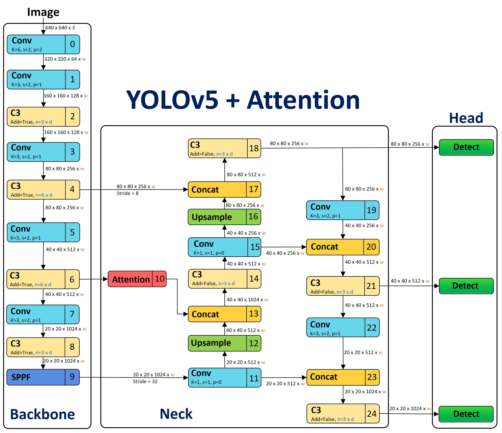

# Subtle Defect Detection using YOLOv5 and Attention Mechanism

This project focuses on detecting defects in materials using the YOLOv5 objectdetection model enhanced with the Convolutional Block Attention Module (CBAM).
The models are trained to identify and classify subtle and camouflaged defects with high accuracy and efficiency.

## Table of Contents

- [Introduction](#introduction)
- [Features](#features)
- [Prerequisites](#prerequisites)
- [Installation](#installation)
- [Usage](#usage)
- [Model Details](#model-details)
- [License](#license)
- [Acknowledgements](#acknowledgements)

## Introduction
Defect detection is crucial for maintaining safety and quality in industries such as
aerospace, automotive, and construction. Traditional methods often fail to identify
subtle and camouflaged defects. This thesis explores the use of the YOLOv5 object
detection model, enhanced with the Convolutional Block Attention Module (CBAM), [YOLOv5s + CBAM (1)](#model-1),
to improve the detection of these concealed defects. YOLOv5 with CBAM boosts the
model’s precision and focus, resulting in more accurate detection of subtle defects,
specifically in MPI materials.
Our proposed model, the enhanced YOLOv5 with CBAM, outperforms the baseline
by 2.16% in mAP50-95. This significant improvement demonstrates the effectiveness
of integrating attention mechanisms into object detection models. Additionally,
we developed another model incorporating patch-wise attention to focus on areas with
cracks. While this model does not surpass the CBAM-enhanced model, it performs
as well as the baseline and yields better results in specific cases, showing its potential
in particular scenarios.
To address the lack of specific data for training and testing these new proposed
models, we created a new synthetic dataset. This dataset is designed to simulate realworld
conditions of defect detection, particularly targeting subtle and camouflaged
defects in MPI (Magnetic Particle Inspection) materials. The synthetic dataset is
used to train and evaluate these models specific to our task.
Our work demonstrates the effectiveness of advanced detection algorithms like
YOLOv5 combined with attention mechanisms such as CBAM. It lays a strong foundation
for further research, suggesting a promising future for deploying deep learning
technologies in industrial quality control. This research highlights the potential for
ongoing innovation in automated defect detection, paving the way for more reliable
and efficient inspection processes.

## Features

- **High Accuracy Detection**: Utilizes the precision of YOLOv5 enhanced with the attention mechanism of CBAM.
- **Focus on Subtle Defects**: Specifically designed to identify subtle and easily missed defects.
- **Real-time Processing**: Optimized for quick processing to support real-time application scenarios.
- **Custom Synthetic Dataset**: Includes a dataset specifically created to train and test the model's effectiveness against targeted defect types.

## Prerequisites

Before you can run this project, you will need the following:
- Python 3.8 or higher
- PyTorch
- OpenCV
- NumPy
- Pandas
- Matplotlib
- Noise (for synthetic data generation)

## Installation

To get started with this project, clone the repository and install the required dependencies:
Clone the current repository.
```bash
git clone https://github.com/yourusername/defect-detection-yolo.git
```

To run YOLOv5 model install the following dependencies:
```bash
cd ./code/yolov5
pip install -r requirements.txt
```

To run YOLOv8 model install the following dependencies:
```bash
cd ./code/ultralytics/
pip install -e .
```

## Usage

To train an existing yolov5 model on your custom/defect detection dataset:
- Go to the yolov5 directory
- create a dataset.yaml file in the same format for training yolov5
- Run the below script with your required parameters

```bash
python train.py --img 640 --batch 16 --epochs 300 --optimizer AdamW --seed 7 --data dataset.yaml --cfg yolov5s_custom_cbam_1.yaml --weights ''
```
- Follow the same training and inference methodology as mentioned in [YOLOv5](https://github.com/ultralytics/yolov5) repository 


To train an existing yolov8 model on your custom/defect detection dataset:
- Go to the yolov8/ultralytics directory
- create a dataset.yaml file in the same format for training yolov8
- Run the below script with your required parameters
```bash
yolo task=detect mode=train model=yolov8s.yaml data=dataset.yaml  epochs=200 imgsz=640 batch=16 pretrained=False
```
- Follow the same training and inference methodology as mentioned in
[Ultralytics](https://github.com/ultralytics/ultralytics)


## Model Details

### Model-1 architecture:
<a id="model-1"></a> <!-- Anchor Tag for Linking -->


### Model-2 architecture:
<a id="model-2"></a> <!-- Anchor Tag for Linking -->


We have the following YOLOv5 models enhanced with attention mechanisms:
* [yolov5s_custom_cbam_1](Models/v5/CBAM/yolov5s_custom_cbam_1.yaml) : YOLOv5 enhanced with the Convolutional Block Attention Module (CBAM) following [Model-1 architecture](#model-1).
* [yolov5s_custom_cbam_2](Models/v5/CBAM/yolov5s_custom_cbam_2.yaml) : YOLOv5 enhanced with the Convolutional Block Attention Module (CBAM) following [Model-2 architecture](#model-2).
* [yolov5s_custom_pwa_1](Models/v5/PWA/yolov5s_custom_pwa_1.yaml) : YOLOv5 enhanced with the Patch Wise Attention (PWA) mechanism following [Model-1 architecture](#model-1).
* [yolov5s_custom_pwa_2](Models/v5/PWA/yolov5s_custom_pwa_2.yaml) : YOLOv5 enhanced with the Patch Wise Attention (PWA) mechanism following [Model-2 architecture](#model-2).

We also have other attention mechanisms incorporated YOLOv5 models including SENET, ECANET and Coordinate Attention. We also have YOLO models with extra block performing Gaussian blur or Edge detection. See the 
[Models](Models) directory for all the available models.


## License

This project is not currently open for reuse, modification, or distribution. For any inquiries regarding the use of the project's contents or code, please contact the repository owner.

## Acknowledgements

Heartfelt thanks to my supervisor, Dr. Mrinal Kanti Das, for his crucial guidance.
Special appreciation to the faculty, colleagues, and friends from the Department of Data Science at IIT Palakkad for their invaluable support throughout my research journey.

